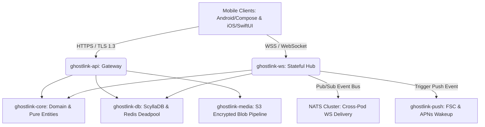

# 👻 GhostLink — God-Tier YC-Grade Implementation Plan

This implementation plan details the end-to-end execution blueprint for the **GhostLink Zero-Knowledge Secure Communication Platform**. ground up on a Rust-based, highly concurrent backend and native mobile architectures (Android & iOS). 

Our engineering philosophy for GhostLink is simple: **We make the server architecturally incapable of betraying its users.** The server acts as a blind relay that mathematically cannot inspect, decrypt, or link messages or metadata to real-world identities. We design for 10 million users from day one and ship for 100 today.

---

## ═══ SYSTEM ARCHITECTURE OVERVIEW ═══

To achieve infinite scalability and bulletproof security, GhostLink is segmented into a 6-crate Rust cargo workspace with a decoupled architecture:



### Unbreakable Architectural Invariants (CTO Mandates)
1. **Rule 1 — Zero Real Identity:** Absolutely no phone numbers, emails, real names, or device fingerprints. Zero tracking.
2. **Rule 2 — Zero Cleartext Message Content:** All DMs must use Signal Protocol (X3DH + Double Ratchet). Group chats use Sender Key. Payloads passing through the server are opaque encrypted binary blobs.
3. **Rule 3 — Zero IP Logging:** Nginx terminates TLS and strips client IP addresses before the request enters our Rust runtime. tracing spans and metric labels must NEVER collect IPs, accounts, or usernames.
4. **Rule 4 — Zero Account Recovery:** No password resets, no secret questions. Lost credentials = lost account.
5. **Rule 5 — Zeroize Secrets:** Every structural key material implements the `zeroize::Zeroize` trait and gets scrubbed on drop.

---

## ═══ USER REVIEW REQUIRED ═══

> [!IMPORTANT]
> ### 1. Client-Side E2EE Integration Strategy (Native libsignal vs Rust bindings)
> The mobile client codebases contain structural managers that act as placeholders for key-agreement and message encryption. To achieve production security, we must decide between:
> * **Option A:** Compile `libsignal-client` in Rust and write JNI/Swift bindings to run E2EE logic natively across both Android and iOS. This reduces cryptographic surface drift but introduces minor compile-time complexity.
> * **Option B:** Utilize platform-specific official bindings (`libsignal-android` in Kotlin and `libsignal-ios` in Swift). This is our recommended path due to seamless platform idiomatic usage.
>
> ### 2. Anonymous Push Token Routing (Privacy-Preserving Wakeup)
> Standard FCM/APNs requires binding a push token to an account. Under Rule 1, Apple/Google could correlate notifications to user accounts. We will implement **blind token wake-ups**:
> * Push notifications will contain *zero* message snippets, *zero* sender IDs, and only the raw action string `{"type": "NEW_MESSAGE"}`.
> * The server will route these notifications as simple wake-up triggers, forcing the client to connect via WS and download the queue, masking all delivery details.

---

## ═══ OPEN QUESTIONS ═══

> [!WARNING]
> ### 1. Key Replenishment Thresholds
> * **Current Design:** Clients check key count at `/keys/pre-keys/count` on startup.
> * **Proposed Optimization:** Should the WebSocket connection push a `pre_key.low` alert payload to the client immediately when their One-Time Pre-Key (OPK) pool falls below 10, instead of relying on REST polling? (Recommended: Yes, prevents X3DH session blockages on active accounts).
>
> ### 2. Disappearing Messages Garbage Collection
> * **Constraint:** Messages are deleted on-device after the timer expires. But what about offline or queued messages?
> * **Proposed Solution:** If a message sits in the `offline_queue` longer than its self-destruct threshold, the server automatically drops it from ScyllaDB on TTL eviction (pre-configured at 7 days). We must ensure client clock drift does not cause state synchronization mismatches.

---

## ═══ PROPOSED CHANGES ═══

### 1. 🏗️ Component: `ghostlink-api` (Gateway Routing & Handlers)

We need to implement the REST endpoint handlers and hook them up to the main Axum router.

#### [MODIFY] [router.rs](file:///home/elliot/v2-startup/ghostlink-server/crates/ghostlink-api/src/router.rs)
Uncomment and wire up all REST endpoints to their respective handler paths:
* `/account/me` -> GET/DELETE handlers.
* `/contacts` -> GET/POST/PATCH/DELETE handlers.
* `/keys/:username/bundle` -> GET (consumes OPK).
* `/keys/pre-keys` -> PUT/GET endpoints.
* `/messages/offline` -> GET/DELETE.
* `/media/upload` and `/media/:id` -> POST/GET.
* `/ws/connect` -> GET (upgrade to WebSocket).

#### [NEW] [handlers/account.rs](file:///home/elliot/v2-startup/ghostlink-server/crates/ghostlink-api/src/handlers/account.rs)
Implement account management:
* `get_me`: Returns account metadata (username, creation date, and last seen).
* `delete_me`: Deletes account from ScyllaDB (`accounts` and `username_index` tables) and purges all active session keys from Redis. Requires password confirmation.

#### [NEW] [handlers/contacts.rs](file:///home/elliot/v2-startup/ghostlink-server/crates/ghostlink-api/src/handlers/contacts.rs)
Implement a fully private contact management handler:
* `list`: Fetches contact list from `contacts` ScyllaDB table.
* `add`: Sends a contact request by searching exact username.
* `respond`: Accepts/declines/blocks. Implements status transition checks (e.g. `pending_sent` -> `accepted`).
* `delete`: Deletes a contact relation.

#### [NEW] [handlers/keys.rs](file:///home/elliot/v2-startup/ghostlink-server/crates/ghostlink-api/src/handlers/keys.rs)
Implement X3DH Signal Key handlers:
* `get_bundle`: Atomic Paxos-backed consumption of one One-Time Pre-Key (OPK) from the `pre_keys` table while fetching the target identity key and signed pre-key.
* `upload_pre_keys`: Allows clients to upload additional OPKs to refill their pool.
* `count_pre_keys`: Returns current OPK pool size, stored and cached in Redis.

#### [NEW] [handlers/messages.rs](file:///home/elliot/v2-startup/ghostlink-server/crates/ghostlink-api/src/handlers/messages.rs)
* `fetch_offline`: Streams undelivered messages from `offline_queue` in chronological order.
* `ack_offline`: Batch acknowledges and purges those entries from the offline queue.

---

### 2. 🔌 Component: `ghostlink-ws` (Stateful WebSocket & NATS Pub/Sub)

This crate is the stateful engine. It must support high-throughput, multi-device delivery and cross-pod routing.

#### [MODIFY] [nats_bridge.rs](file:///home/elliot/v2-startup/ghostlink-server/crates/ghostlink-ws/src/nats_bridge.rs)
* Implement a robust NATS subscriber daemon that spawns on startup.
* Subscribes to NATS topic `user.{account_id}`.
* When an incoming payload is received from NATS, check the local `ConnectionHub` DashMap:
  * If the recipient has an active socket on *this* pod, deliver it immediately over WebSocket.
  * If not, gracefully ignore (it will be delivered by another pod hosting that user's active socket).

#### [MODIFY] [router.rs](file:///home/elliot/v2-startup/ghostlink-server/crates/ghostlink-ws/src/router.rs)
* Implement the HTTP-to-WS upgrade routine in Axum.
* Extract JWT from the `Sec-WebSocket-Protocol` header or query parameters.
* Upgrade the HTTP connection to a stateful WebSocket using `axum::extract::ws::WebSocket`.
* Hand off the stream to the WebSocket session task (`session.rs`).

#### [MODIFY] [session.rs](file:///home/elliot/v2-startup/ghostlink-server/crates/ghostlink-ws/src/session.rs)
* Implement the session loop:
  1. **Authentication State:** Up to 5-second window to verify JWT.
  2. **Active State:** Register the sender channel in `ConnectionHub`. Fetch offline queue messages.
  3. **Event Loop:** Listen concurrently for incoming client messages and outgoing NATS events.
  4. **Clean Drop:** On socket close, unregister from `ConnectionHub` and update Redis presence timestamp to offline.

---

### 3. 📂 Component: `ghostlink-media` (Encrypted Blob Pipeline)

Handles anonymous, E2EE attachments with S3/MinIO.

#### [MODIFY] [storage.rs](file:///home/elliot/v2-startup/ghostlink-server/crates/ghostlink-media/src/storage.rs)
* Implement S3 upload stream handler utilizing multipart chunks (prevents buffering entire files in-memory and running out of RAM).
* Validate client uploads strictly up to 50MB.
* Return an opaque `media_id` UUID mapping to the S3 bucket path.
* Implement automatic cleanup worker that runs an hourly cron loop, deleting attachments older than 30 days.

---

### 4. 📣 Component: `ghostlink-push` (Zero-Knowledge FCM & APNs)

Triggers content-free wakeup notifications.

#### [NEW] [client.rs](file:///home/elliot/v2-startup/ghostlink-server/crates/ghostlink-push/src/client.rs)
* APNs client utilizing HTTP/2 with token-based authentication (P8 certificate).
* FCM client using Google HTTP v1 OAuth API.
* Payload is hardcoded to be content-free: `{"type": "NEW_MESSAGE"}`.
* Listen to NATS topic `push.wakeup` and deliver notifications asynchronously to registered token queues.

---

## ═══ VERIFICATION & TESTING PLAN ═══

### 1. Automated Integration Suite
We will verify compiling correctness, architectural invariants, and high-concurrency throughput.

* **Database & Routing Tests:**
  ```bash
  # Run ScyllaDB + Redis test instances locally
  docker-compose -f docker-compose.yml up -d
  
  # Run cargo test across all workspaces
  cargo test --all
  ```
* **Security & Clippy Checks:**
  ```bash
  # Audit dependencies for known vulnerabilities
  cargo audit
  
  # Run clippy with strict CTO rules
  cargo clippy --all -- -D warnings
  ```

### 2. High-Performance Load Testing (Locust)
To verify the **DashMap + NATS WebSocket cross-pod delivery model** scales seamlessly to 50,000 active connections under memory pressure, we will simulate realistic user behaviors using Locust:

* **Locust Scenario:**
  1. 10,000 mock devices register and login concurrently.
  2. Establish stateful WebSocket connections.
  3. Send 10 messages/sec per pod with cross-pod routing triggers.
  4. Verify latency budgets: WebSocket P99 delivery under 200ms.

### 3. Manual Client-Server E2EE Handshake Verification
Deploy a local test environment and utilize both mock clients to execute an end-to-end Signal X3DH key exchange:
* Alice registers and uploads key bundles.
* Bob queries Alice's key bundle, consumes an OPK, calculates the Master Secret, and sends a DM.
* Confirm that the backend stores *only* the opaque ciphertext block and completely purges the consumed OPK.
